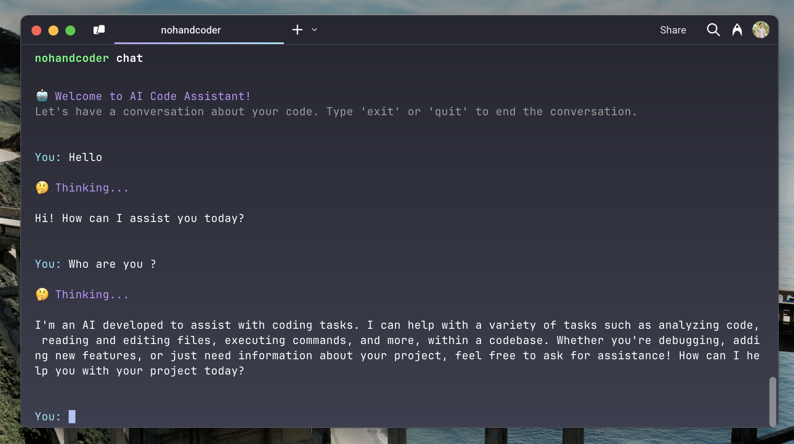

# NoHandCoder

<p align="center">
  
</p>

NoHandCoder is your AI-powered coding assistant that transforms how you interact with your codebase. Through natural conversation, it helps you:

- 🤖 **Chat with AI**: Ask questions about your code and get helpful responses
- 📂 **Browse Files**: Easily navigate through your project files and folders
- 📄 **Read Code**: View and understand your code files
- 🔍 **Search Code**: Find specific code patterns or functions across your project
- 📊 **Project Overview**: Get a clear picture of your project structure
- ⚡ **Run Commands**: Execute commands safely through the AI interface

No more context switching or complex IDE commands - just chat naturally and code efficiently!

### Prerequisites

Before using NoHandCoder, make sure you have the following:

1. Node.js installed on your system
2. An OpenAI API key

## Getting Started

Set up your environment variables:

```bash
export OPENAI_API_KEY=your_api_key_here
export MODEL_NAME=gpt-4-turbo-preview
```

## How to Use

1. Install NoHandCoder globally:

   ```bash
   npm install -g nohandcoder
   ```

2. Start the chat interface:

   ```bash
   nohandcoder chat
   ```

3. Let's feel free to ask

## Tips for Best Results

1. **Be Specific**: The more specific your questions, the better the AI can help you
2. **Use Natural Language**: Just ask questions as you would to a human assistant
3. **Explore Features**: Try different commands to discover what the AI can do
4. **Stay in Context**: The AI remembers your conversation, so build on previous questions

## Need Help?

- Type "exit" to quit the chat
- Ask the AI for help with any feature
- Check the project's issues page for known problems

## License

This project is licensed under the MIT License - see the [LICENSE](LICENSE) file for details.
